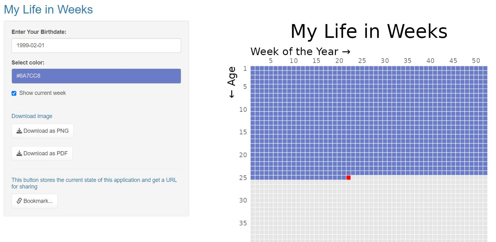

# My Life in Weeks

This application creates an interactive visualization called "My Life in Weeks". It uses the Shiny package to build a user interface for data input. The interface includes controls for entering a birth date, selecting a color, showing the current week, and downloading the visualization as PNG or PDF. The main panel displays the "My Life in Weeks" plot, which visualizes age in weeks using colored tiles. The color can be chosen by the user or automatically assigned. The application also supports bookmarking the current state for sharing.

